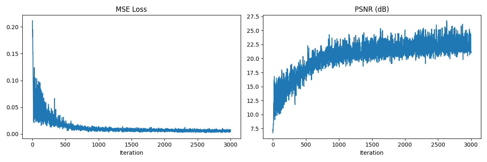
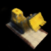
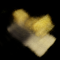
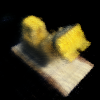

# Experiment 1: TinyNeRF Baseline

## Objective
Establish a functional, single-pass volumetric rendering baseline without hierarchical sampling or view-dependent appearance conditioning. This serves as the foundation for future ablation studies.

## Experimental Setup
* **Dataset:** Synthetically rendered Lego scene (106 images, $100 \times 100$ resolution).
* **Model:** 4-layer MLP (128 hidden units per layer).
* **Positional Encoding:** Standard Fourier features ($L=10$ for spatial coordinates, no directional encoding).
* **Sampling:** 64 stratified coarse samples per ray.
* **Optimization:** Adam, tracking Mean Squared Error (MSE) and Peak Signal-to-Noise Ratio (PSNR). Configured for 3000 iterations.

## Training Dynamics & Compute Profile
The model optimizes rapidly in early iterations, efficiently capturing low-frequency volumetric structures before the gradients push to resolve sharper high-frequency geometry.

### Computational Footprint
* **Hardware:** CPU execution (PyTorch 2.x).
* **Iteration Throughput:** ~1.42 optimization steps per second ($1.42 \text{ it/s}$).
* **Total Convergence Time:** $35\text{m } 19\text{s}$ for 3,000 full forward-backward passes.
* **GPU Projection:** On a standard consumer GPU (e.g., RTX 3080), this baseline completes in under 5 minutes.

### Metric Trajectories
* **Iterations 0–500 (Initial Convergence):** Mean Squared Error drops exponentially. PSNR reaches ~18.00 dB. The network successfully captures the density distributions and primary color channels, though edges remain highly diffuse.
* **Iterations 500–1500 (Structure Hardening):** PSNR climbs to ~21.00 dB. Boundary edges begin to harden. Characteristic low-density "fog" artifacts (floating volumetric noise) start to diminish as occupancy probabilities sharpen.
* **Iterations 1500–3000 (Fine Tuning):** PSNR stabilizes at ~23.5–24.5 dB. The global geometry reaches its representation capacity limit given the simplified 4-layer architecture.

### Quantitative Curves
The loss function minimizes rapidly before asymptoting at ~1000 iterations. This hard plateau indicates that uniform depth sampling (64 static bins/ray) becomes the primary bottleneck preventing deeper geometric refinement.

## Qualitative Results
At 3000 iterations, the model attains a PSNR of approximately 24 dB. The scene is recognizable, but lacks sharp high-frequency details when compared to the original ground truth target.

### Ground Truth vs Predicted

| Target Ground Truth | Predicted (3000 Iters) |
|:---:|:---:|
|  |  |

### Visual Progression

| Iteration 500 | Iteration 1500 | Iteration 3000 |
|:---:|:---:|:---:|
|  |  |  |

*(Note the gradual reduction of volumetric "fog" and hardening of surface edges over time).*

## Limitations and Comparison
The baseline exhibits noticeable semi-transparent artifacts ("floaters") and blurred texturing. This is primarily due to the uniform sampling strategy along intersecting rays. 

Compared to the full NeRF architecture, this implementation:
1. **Lacks geometric precision** afforded by inverse-transform importance sampling (fine network).
2. **Cannot model specular highlights** due to the absence of directional view conditioning.

## Conclusion
The TinyNeRF baseline successfully demonstrates the core mechanics of differentiable volume rendering and implicit neural representation. However, the visual quality plateaus heavily without hierarchical sampling to focus network capacity on solid surfaces.
